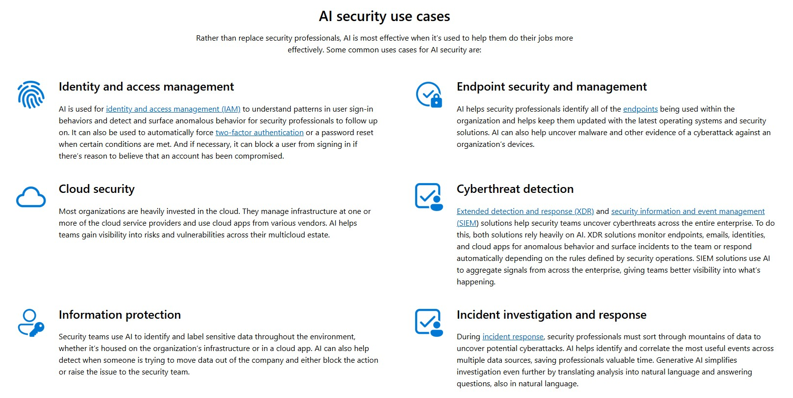
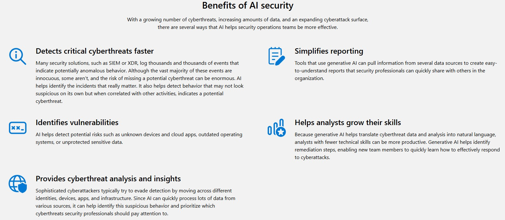
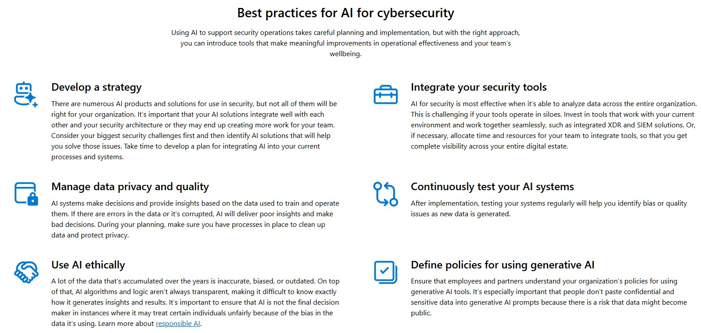

# How-does-AI-for-cybersecurity-work-
AI uses machine learning algorithms to continuously learn based on the data the system evaluates. When generative AI identifies certain known cyberthreats, such as malware, it can help contextualize threat analysis and make it easier to understand by generating new text or pictures to describe what’s happening.

